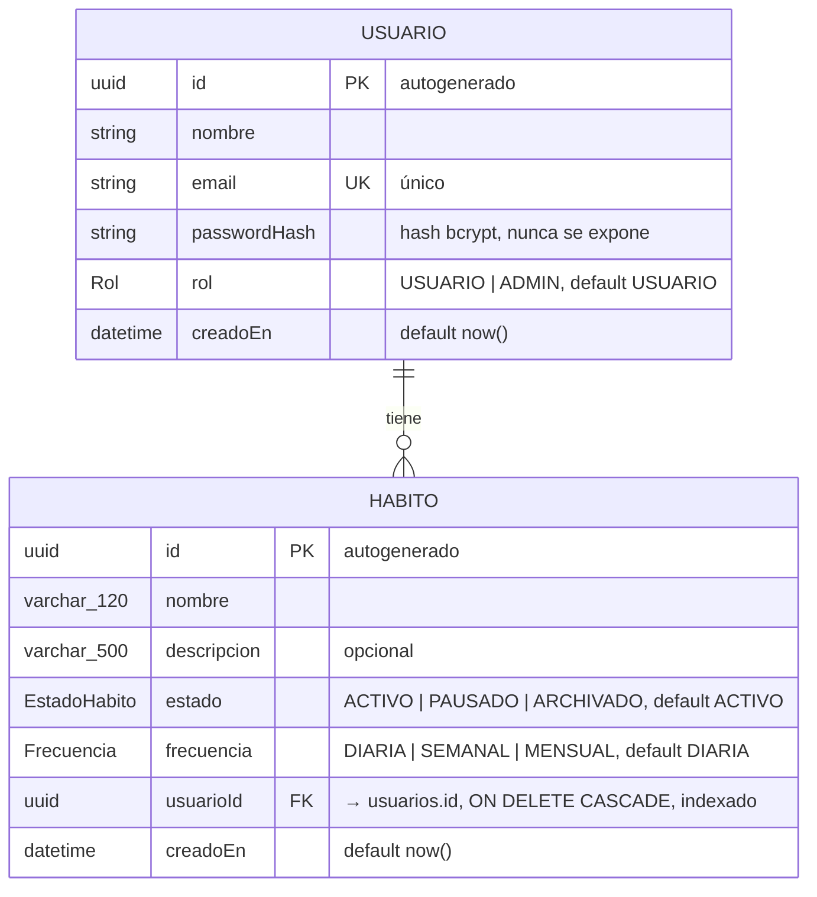

# Modelo de datos

Fuente de verdad: [`prisma/schema.prisma`](../prisma/schema.prisma). La estructura en la base se crea con la migración versionada [`prisma/migrations/20261008201005_modelo_inicial`](../prisma/migrations/20261008201005_modelo_inicial/migration.sql).

## Diagrama

## Claves y restricciones

| Tabla | Clave primaria | Clave foránea | Otras restricciones |
|-------|----------------|---------------|---------------------|
| `usuarios` | `id` (UUID) | — | `email` único (`usuarios_email_key`); `rol` con default `USUARIO`. |
| `habitos` | `id` (UUID) | `usuarioId` → `usuarios.id` (`habitos_usuarioId_fkey`) con `ON DELETE CASCADE` | `nombre` `VARCHAR(120)`; `descripcion` `VARCHAR(500)` opcional; índice `habitos_usuarioId_idx`; defaults `ACTIVO` y `DIARIA`. |

## Cardinalidad

- Un `Usuario` tiene **cero o muchos** `Habito`.
- Cada `Habito` pertenece a **exactamente un** `Usuario`: `usuarioId` es obligatorio.
- Si se borra un usuario, sus hábitos se borran con él (`ON DELETE CASCADE`), así que nunca quedan hábitos huérfanos.

## Notas

- El índice por `usuarioId` acelera `GET /habitos`, que siempre filtra por el dueño.
- El email se guarda normalizado (trim y minúsculas, ver D-07 en [decisiones](decisiones.md)). Por eso basta la restricción única de la columna para que no se repitan correos.
- Las longitudes `VARCHAR(120)` y `VARCHAR(500)` repiten en la base los límites del contrato. Los DTO los validan antes (Parte 7), y la base actúa como última barrera.
